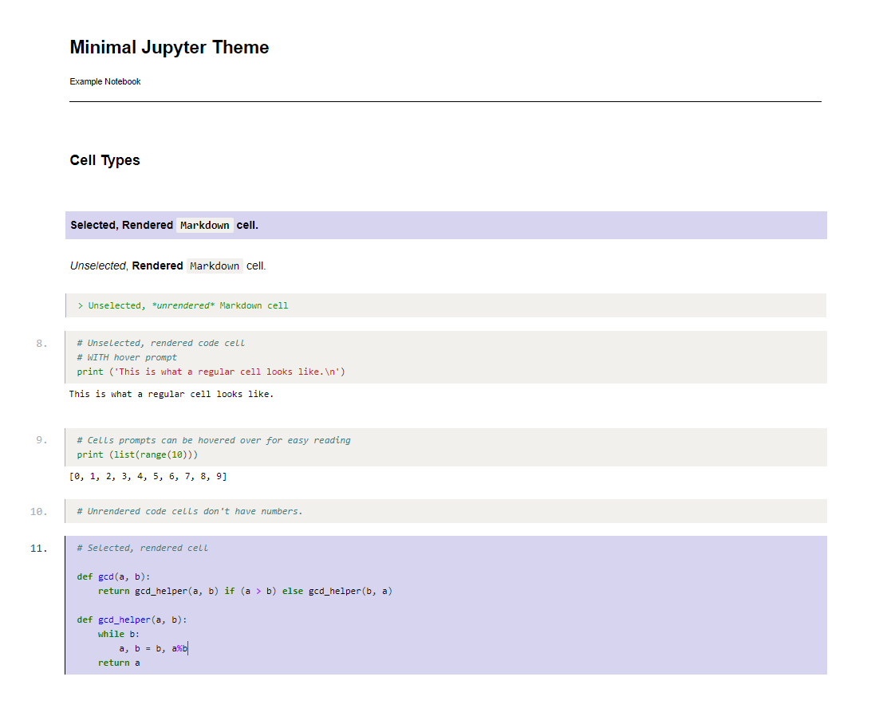

# Minimal Jupyter Theme

A Jupyter theme that doesn't just change colorschemes. 

*Note:* This was heavily inspired by Mike Bostock's work at [Observable Notebooks](https://www.observablehq.com).

*Note:* Working in Chrome on Windows/Linux. Firefox has issues with blinking cursor.

#### Theme Preview 

80% of the changes can be seen in the preview below. To see the whole introductory notebook as a screenshot, check [here](imgs/theme-preview.png).

#### Installation

To install this theme, you must have a custom folder in your jupyter directory. If you have a `~/.jupyter/custom/` or `~/.jupyter/custom/custom.css` already created you can copy the files within this repo's `custom/` directory into your `~/.jupyter/` folder. If you don't you can copy the entire directory  

1. Start a terminal.
2. Go to your Jupyter config directory: `cd ~/.jupyter/`
3. If you don't have a `custom/` folder in your config: `git clone https://github.com/ryan-p-larson/minimal-jupyter-theme.git`
4. If you *do* have a custom config already, back up your files and copy over. 
	* Back up: `mv ~/.jupyter/custom/custom.css ~/.jupyter/custom/custom.css.bak && mv ~/.jupyter/custom/custom.js ~/.jupyter/custom/custom.js.bak`
	* Copy over: `cp minimal-jupyter-theme/custom/custom.css ~/.jupyter/custom/ && cp minimal-jupyter-theme/custom/custom.js ~/.jupyter/custom/`
5. Start Jupyter Notebook to see the changes! `jupyter notebook`
